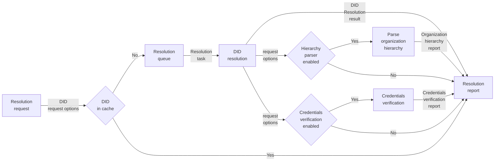

# The ORGiD DID Resolver App

## Flow

```mermaid
graph LR
  REQUEST[Resolution<br>request] -->|DID<br>request options| IS_CACHED{DID<br>in cache}
  IS_CACHED -->|No| QUEUE[Resolution<br>queue]
  QUEUE -->|Resolution<br>task| RESOLUTION[DID<br>resolution]
  IS_CACHED -->|Yes| DID_REPORT[Resolution<br>report]
  RESOLUTION -->|DID<br>Resolution<br>result| DID_REPORT
  RESOLUTION -->|request<br>options| IS_HIERARCHY{Hierarchy<br>parser<br>enabled}
  RESOLUTION -->|request<br>options| IS_CREDENTIALS{Credentials<br>verification<br>enabled}
  IS_HIERARCHY -->|Yes| HIERARCHY_PARSER[Parse<br>organization<br>hierarchy]
  IS_HIERARCHY -->|No| DID_REPORT
  IS_CREDENTIALS -->|Yes| CREDENTIALS_VERIFICATION[Credentials<br>verification]
  IS_CREDENTIALS -->|No| DID_REPORT
  HIERARCHY_PARSER -->|Organization<br>hierarchy<br>report| DID_REPORT
  CREDENTIALS_VERIFICATION -->|Credentials<br>verification<br>report| DID_REPORT
```
